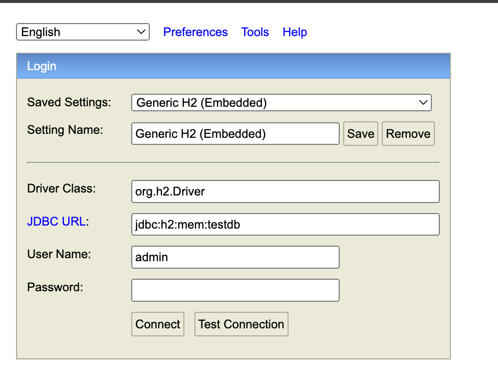

# linktic-batch

Linktic Batch - Spring Batchs

La implementación de este proyecto se basa en procesamiento por lotes con Spring Batch, demostrando la lectura y procesamiento de un csv y a su ves la
extracción de información de una base de datos

## Tecnologias

### Java 11

### Spring Boot

### Spring data

### Spring Batch

### Tomcat

### Base de datos H2

### Intellij

### Consumo Servicio /api/v1

```
http://localhost:7080/api/v1
```

### Base de datos

la información de conexión se encuentra en el application.properties

```
http://localhost:7080/h2-console
```



## Endpoints

### GET /process-csv

proceso para extraer información de un archivo csv y procesarlo en batch

```
http://localhost:7080/api/v1/process-csv
```

### GET /process-db

proceso para extraer información de una base de datos y procesarlo en batch

```
http://localhost:7080/api/v1/process-db
```

## Compilación del proyecto

##### Clonar del repositorio

```
git clone https://github.com/veroyuu6/linktic-batch.git
```

##### Compilar

Ubíquese en la ruta /linktic-batch

```
mvn clean install
```

##### Desplegar

Ubíquese en la ruta /linktic-batch/target y ejecute:

```
java -jar linktic-batch-0.0.1-SNAPSHOT.jar
```


